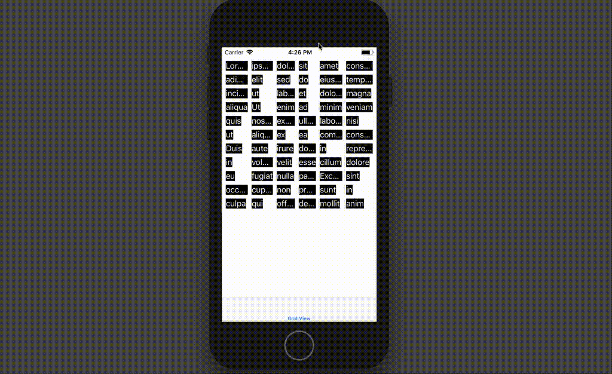

# An example of a grid view

This is a little experiment with UILayoutGuide and UIStackView, to create a
grid of labels or some other views.

Note that each column width is sized such that it can contain the view with
the biggest width, but not bigger.

This is how it looks like:

